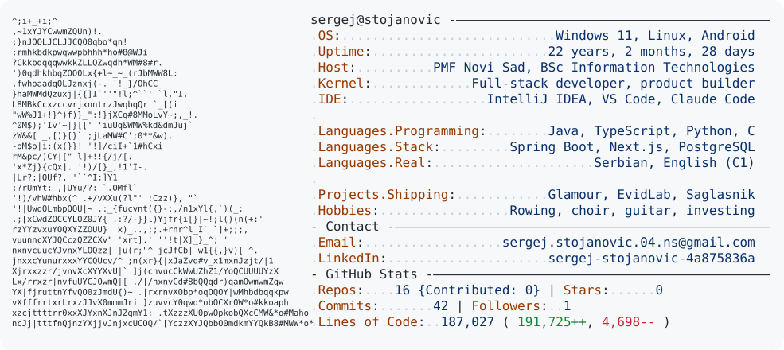

<a href="https://www.linkedin.com/in/sergej-stojanovic-4a875836a/">
  <picture>
    <source media="(prefers-color-scheme: dark)" srcset="dark_mode.svg">
    
  </picture>
</a>

### What I'm building

| | Project | What it is | Stack |
|---|---|---|---|
| 💇 | **[Glamour](https://github.com/Excapex/glamour-showcase)** | Multi-tenant booking & operations SaaS for salons. Solo-built, MVP-ready. | Java 21 · Spring Boot · PostgreSQL · Next.js · Stripe |
| 🧪 | **[EvidLab](https://github.com/Excapex/evidlab-showcase)** | Lab inventory for the Chemistry and Biology departments at PMF Novi Sad, in pilot testing. Team of 3, Scrum. | Spring Boot · React/TS · PostgreSQL |
| 🔥 | **[Saglasnik](https://github.com/Excapex/saglasnik-showcase)** | AI copilot for technical projects, starting with fire-protection compliance. Born at the Grok Bot Serbia Hackathon. | Python · TypeScript · LLMs |

Commercial products live in private repos. Each showcase repo has screenshots, architecture and the engineering decisions behind it. Happy to walk through the code on a call.

### Tools I ship with

  

### Right now
- 3rd-year Information Technologies at PMF, University of Novi Sad
- Developer at a digital agency: websites, automations and SEO for real clients
- Level Up Academy, current cohort
- Open to internships and junior backend / full-stack roles

The card above is regenerated daily by a GitHub Action ([today.py](today.py)). Idea borrowed from [Andrew6rant](https://github.com/Andrew6rant).
